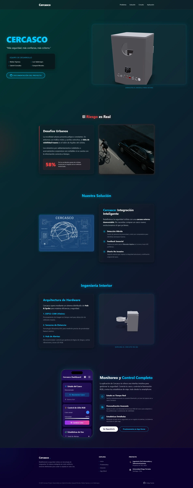

# 🌐 Cercasco Web - Plataforma de Presentación


Este directorio contiene el código fuente de la página web oficial de **Cercasco**, una landing page moderna diseñada para presentar el proyecto de seguridad ciclista al mundo. La web no solo actúa como escaparate visual del producto, sino que también detalla su funcionamiento interno mediante modelos 3D interactivos.

La plataforma utiliza tecnologías de vanguardia para ofrecer una experiencia inmersiva, destacando el diseño 3D del producto y explicando su arquitectura de hardware de manera visual.




---

## 🚀 Tecnologías Utilizadas

El proyecto está construido sobre un stack moderno enfocado en el rendimiento, la modularidad y la experiencia visual:

* **React:** Biblioteca de JavaScript para construir interfaces de usuario interactivas y basadas en componentes.
* **Vite:** Herramienta de compilación y servidor de desarrollo de última generación que ofrece tiempos de inicio instantáneos y recarga rápida de módulos (HMR).
* **Tailwind CSS:** Framework de utilidades CSS para un diseño rápido, responsivo y altamente personalizable directamente en el marcado.
* **React Three Fiber (R3F):** Un renderizador de React para Three.js que permite construir escenas 3D de manera declarativa como componentes de React.
* **Drei:** Una colección indispensable de utilidades, abstracciones y componentes listos para usar en React Three Fiber (cámaras, controles, entornos, cargadores, etc.).

---

## 📂 Estructura del Proyecto

La estructura de carpetas sigue las mejores prácticas de React + Vite, organizada para escalabilidad y claridad:

```bash
web/
├── public/                 # Archivos estáticos accesibles directamente desde la raíz
│   ├── cercasco-helmet.glb # Modelo 3D del casco completo (formato binario GLTF)
│   ├── cercasco-circuito.glb # Modelo 3D del circuito electrónico interno
│   ├── cercasco.svg        # Logo vectorial del proyecto
│   ├── riesgo.webp         # Imagen optimizada para la sección de problemática
│   └── preview.webp        # Imagen de vista previa para el README
├── src/
│   ├── assets/             # Recursos importados dentro del código (imágenes, iconos)
│   │   ├── blueprint.png   # Diagrama técnico estilo plano (blueprint)
│   │   └── react.svg       # Logo de React
│   ├── components/         # Componentes React reutilizables y secciones de la página
│   │   ├── AppShowcase.jsx # Sección para mostrar la app móvil
│   │   ├── Features.jsx    # Sección técnica "Ingeniería Interior" con circuito 3D
│   │   ├── Footer.jsx      # Pie de página
│   │   ├── Header.jsx      # Barra de navegación fija con efecto glassmorphism
│   │   ├── Hero.jsx        # Sección principal (landing) con el casco 3D interactivo
│   │   ├── Problem.jsx     # Sección que explica la problemática de seguridad vial
│   │   └── Solution.jsx    # Sección que detalla la solución propuesta por Cercasco
│   ├── App.jsx             # Componente raíz que orquesta la estructura y el layout
│   ├── App.css             # Estilos generales de la aplicación
│   ├── index.css           # Configuración global de estilos y directivas de Tailwind
│   └── main.jsx            # Punto de entrada de la aplicación (montaje en el DOM)
├── index.html              # Plantilla HTML principal donde se inyecta la app
├── package.json            # Manifiesto del proyecto: dependencias y scripts
├── package-lock.json       # Versiones exactas de las dependencias instaladas
├── postcss.config.js       # Configuración de PostCSS (necesario para Tailwind)
├── tailwind.config.js      # Configuración de temas, colores personalizados y plugins de Tailwind
└── vite.config.js          # Archivo de configuración de Vite
````

-----

## 🎨 Diseño y Estilo

El diseño de la web sigue una estética **"Cyberpunk / Tech / Glassmorphism"** con las siguientes características distintivas:

  * **Glassmorphism:** Uso extensivo de paneles semitransparentes con desenfoque de fondo (`backdrop-blur`) para dar una sensación de profundidad, modernidad y sofisticación.
  * **Paleta de Colores:**
      * **Fondo:** Gradiente animado oscuro que transiciona entre tonos profundos (`#0b022d`, púrpuras y verdes oscuros) para un ambiente inmersivo.
      * **Acento:** Azul Neón (`#00c6ff`) utilizado para botones, títulos destacados, bordes brillantes y elementos interactivos.
      * **Texto:** Blanco y gris claro para garantizar la máxima legibilidad sobre los fondos oscuros.
  * **Tipografía:** Fuente **Inter**, elegida por su limpieza, legibilidad y carácter técnico moderno.
  * **Interactividad:** Animaciones suaves, efectos de brillo en textos y botones, y modelos 3D completamente manipulables por el usuario.

-----

## 🛠️ Instalación y Ejecución

Si deseas ejecutar este proyecto localmente para desarrollo o pruebas:

### 1\. Prerrequisitos

Asegúrate de tener instalado **Node.js** (versión 16 o superior) en tu sistema.

### 2\. Instalación de Dependencias

Navega a la carpeta `web` desde tu terminal e instala los paquetes necesarios:

```bash
cd web
bun install
```

### 3\. Servidor de Desarrollo

Inicia el servidor local con **Hot Module Replacement (HMR)** para ver los cambios en tiempo real:

```bash
bun run dev
```

La aplicación estará disponible generalmente en `http://localhost:5173` (o el puerto que indique la consola).

### 4\. Construcción para Producción

Para generar los archivos optimizados y minificados listos para el despliegue:

```bash
bun run build
```

Los archivos resultantes se guardarán en la carpeta `dist/`.

-----

## 🔧 Componentes Clave

### Hero.jsx (El Casco 3D)

Es la primera impresión de la web. Muestra el modelo `cercasco-helmet.glb` dentro de una "vitrina" virtual con estilo neón.

  * **Tecnología:** Utiliza `<Stage>` de `drei` para una iluminación de estudio automática y profesional.
  * **Interacción:** Implementa `OrbitControls` configurados para permitir la rotación pero limitando el zoom y el desplazamiento para mantener el modelo siempre en foco.
  * **Características:** Animación de entrada, título con efecto de brillo dinámico y enlaces a la documentación.

### Features.jsx (Ingeniería Interior)

Esta sección desglosa la tecnología detrás del producto. Muestra el modelo `cercasco-circuito.glb` detallando la electrónica interna.

  * **Layout:** Divide la pantalla en especificaciones técnicas a la izquierda y la visualización 3D a la derecha.
  * **Detalle:** La cámara 3D está ajustada específicamente para mostrar los detalles del circuito impreso y los componentes.

-----

## 👥 Autores

Proyecto desarrollado con pasión por estudiantes de Ingeniería Civil en Informática y Telecomunicaciones de la **Universidad Diego Portales**:

  * Matías Vigneau
  * Luis Valdenegro
  * Gabriel González
  * Ezequiel Morales

📍 *Santiago de Chile, 2025*
